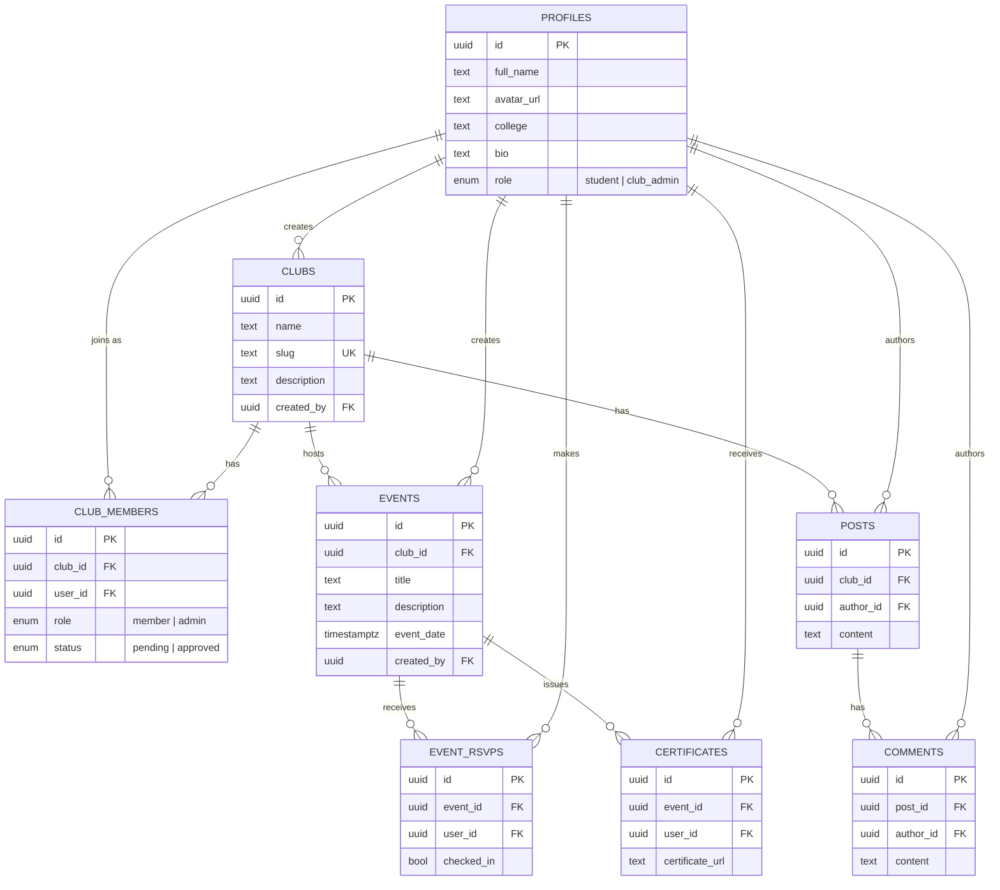

# CampusConnect: Every club. Every event. One brutally simple OS.

**🗣️ Join our Discord Server for all contributors:** [https://discord.gg/BEMjApACe](https://discord.gg/BEMjApACe)


CampusConnect solves the chaos of college clubs juggling WhatsApp groups, spreadsheets, and paper certificates. It provides a single, unified platform for students and organizers to manage events, track memberships, and engage with their campus community seamlessly.

<!-- TODO: Add a demo screenshot or Loom link here -->
<!--  -->

## ✨ Features

- **Event Management:** Create, manage, and promote campus events.
- **RSVP + QR Check-in:** Seamless registration and fast, verifiable QR code check-ins.
- **Club Directory:** Discover and join various campus clubs in one centralized place.
- **Discussion Feed:** Engage with the community through club-specific discussion boards.
- **Certificate Generation:** Automatically generate and distribute event certificates.
- **Realtime Updates:** Instant notifications and live updates powered by Supabase Realtime.

## 🛠️ Tech Stack

| Category            | Technology                                   |
| :------------------ | :------------------------------------------- |
| **Frontend**        | Vite, React, TypeScript, Tailwind CSS        |
| **Backend**         | Supabase (Postgres, Auth, Storage, Realtime) |
| **Package Manager** | npm                                          |

## 🗄️ Architecture / Database

CampusConnect stores its data in Supabase (Postgres) and uses Supabase Auth plus Row Level Security to protect access. The schema is defined in [supabase/schema.sql](./supabase/schema.sql) and centers on clubs, the members and events they run, and the posts their members write.

### Entity-relationship diagram



### Core tables

| Table          | Key columns                                                                                                       | Purpose                                                                                                                             |
| :------------- | :---------------------------------------------------------------------------------------------------------------- | :---------------------------------------------------------------------------------------------------------------------------------- |
| `profiles`     | `id` (PK, = `auth.users.id`), `full_name`, `avatar_url`, `college`, `bio`, `role`                                 | One row per authenticated user; auto-created by the `on_auth_user_created` trigger on signup.                                       |
| `clubs`        | `id` (PK), `name`, `slug` (unique), `description`, `banner_url`, `logo_url`, `created_by` → `profiles.id`         | A campus club/society. `slug` is used for the public `/clubs/:slug` route.                                                          |
| `club_members` | `id` (PK), `club_id` → `clubs.id`, `user_id` → `profiles.id`, `role`, `status`                                    | Join table linking users to clubs, with a `member`/`admin` role and a `pending`/`approved` status. Unique per `(club_id, user_id)`. |
| `events`       | `id` (PK), `club_id` → `clubs.id`, `title`, `description`, `event_date`, `location`, `created_by` → `profiles.id` | An event hosted by a club.                                                                                                          |
| `event_rsvps`  | `id` (PK), `event_id` → `events.id`, `user_id` → `profiles.id`, `checked_in`                                      | A user's RSVP to an event, plus a `checked_in` flag set on QR check-in. Unique per `(event_id, user_id)`.                           |
| `posts`        | `id` (PK), `club_id` → `clubs.id`, `author_id` → `profiles.id`, `content`                                         | A discussion post on a club's feed.                                                                                                 |
| `comments`     | `id` (PK), `post_id` → `posts.id`, `author_id` → `profiles.id`, `content`                                         | A reply to a post.                                                                                                                  |
| `certificates` | `id` (PK), `event_id` → `events.id`, `user_id` → `profiles.id`, `certificate_url`                                 | A generated certificate issued to a user for attending an event.                                                                    |

### Notes

- All tables have Row Level Security enabled; the policies in [supabase/schema.sql](./supabase/schema.sql) define exactly who can read and write data.
- `posts`, `comments`, and `event_rsvps` are included in the `supabase_realtime` publication to power live-updating feed and RSVP behavior.
- Storage buckets such as `avatars`, `club-banners`, `event-banners`, and `certificates` are public-read, with writes restricted to the authenticated user's own folder.

## 🚀 Getting Started

1. **Clone the repository:**
   ```bash
   git clone https://github.com/krushit1307/CampusConnect.git
   cd CampusConnect
   ```
2. **Install dependencies:**
   ```bash
   npm install
   ```
3. **Set up database & environment variables:**
   Choose one of the following two options to run your database:
   - **Option A: Remote Supabase (Default)**
     1. Copy `.env.example` to `.env.local`:
        ```bash
        cp .env.example .env.local
        ```
     2. Fill in your remote hosted Supabase URL and Anon Key.
     3. Apply database migrations to your remote project:
        ```bash
        supabase db push
        ```

   - **Option B: Local Supabase Container (Recommended for offline development)**
     Follow the [Supabase Local Development & Seeding](#️-supabase-local-development--seeding) guide below to spin up a local container stack pre-populated with test records.

4. **Start the development server:**
   ```bash
   npm run dev
   ```

### 🐳 Running with Docker

Alternatively, you can run the project containerized using Docker. This allows you to build and run the application without needing Node/npm installed locally on your host machine.

#### Local Development (with Hot-Reloading / HMR)

1. **Set up environment variables:**

   ```bash
   cp .env.example .env.local
   ```

   Fill in your Supabase URL and Anon Key in `.env.local`.

2. **Start the development container:**
   ```bash
   docker compose up --build
   ```
   This will build the dev image and launch the Vite dev server inside the container. The application will be accessible at `http://localhost:8080` with volume-mounted hot-reloading (HMR) fully functional.

#### Production Build & Run

1. **Build the production Docker image:**

   ```bash
   docker build --target runner -t campusconnect:latest .
   ```

2. **Run the production container:**
   ```bash
   docker run -d -p 3000:3000 --env-file .env.local --name campusconnect campusconnect:latest
   ```
   The production-built SPA will be served via the static file server (`serve -s dist -l 3000`) on `http://localhost:3000`.

### 🗄️ Supabase Local Development & Seeding

Instead of connecting to a remote Supabase instance, you can spin up the full Supabase database stack locally using Docker. This avoids API rate limits and populates your workspace with pre-seeded test data (users, events, clubs, posts, comments).

1. **Start the local Supabase container stack:**

   ```bash
   supabase start
   ```

   _Note: This command requires Docker to be running on your system._

2. **Copy the credentials to `.env.local`:**
   After the database starts successfully, the CLI will output your local API credentials. Copy these keys and update your `.env.local` file:
   - `VITE_SUPABASE_URL`: Set to `http://127.0.0.1:54321`
   - `VITE_SUPABASE_ANON_KEY`: Paste the `anon key` printed by the CLI
   - `SUPABASE_SERVICE_ROLE_KEY`: Paste the `service_role key` printed by the CLI

3. **Reset and seed the database:**
   To apply the initial schema and automatically seed the database with test data:

   ```bash
   supabase db reset
   ```

   This will completely provision your local database. You can log in using:
   - **Admin Account**: `admin@campusconnect.com` / `password123`
   - **Student Account**: `student@campusconnect.com` / `password123`

4. **Access Supabase Studio:**
   You can view and manage your local database tables by opening the local Supabase Studio dashboard in your browser at `http://127.0.0.1:54323/`.

## 📁 Project Structure

- `src/` — Contains all frontend React components, pages, hooks, and utilities.
- `supabase/` — Database migrations, seed data, and Edge Functions.
- `public/` — Static assets like images and fonts.

## 🤝 Contributing

We welcome contributions! Please see our [CONTRIBUTING.md](./CONTRIBUTING.md) for details on how to get started. This is an **ECSoC 2026** project, so we are actively looking for contributors. Check out issues labeled `good first issue` to begin!

> [!NOTE]
> **Automated Assignments**: We use a bot to manage issue assignments. Simply comment `/claim` on an issue to assign it to yourself. You have a **30-hour** window to submit a Pull Request before the issue is automatically unassigned.

> [!IMPORTANT]
> **Code Formatting**: Before committing and pushing your code, you **MUST** run `npm run lint` locally. This will automatically format your files and prevent our CI (GitHub Actions) from failing due to Prettier or ESLint errors. Pull Requests with failing CI checks will not be merged.

## 🗺️ Roadmap

- **Phase 1:** Core web platform ✅
- **Phase 2:** Contributor feature build (In Progress)
- **Phase 3:** AI layer (Q4 2026) — AI event recommender, AI post summarizer, RAG chatbot via pgvector

## 📄 License

This project is licensed under the MIT License - see the [LICENSE](./LICENSE) file for details.

## 👤 Maintainer

**Krushit Prajapati** - [GitHub Profile](https://github.com/krushit1307)

## 👥 Contributors

<!-- START_CONTRIBUTORS_GALLERY -->

### 🏆 Hall of Fame (Top 5)

| Rank |                                                                                                  Contributor                                                                                                   | Contributions |
| :--: | :------------------------------------------------------------------------------------------------------------------------------------------------------------------------------------------------------------: | :-----------: |
|  🥇  |      <a href="https://github.com/krushit1307"><br /><sub><b>krushit1307</b></sub></a>      |      127      |
|  🥈  |     <a href="https://github.com/Aryanbuha890"><br /><sub><b>Aryanbuha890</b></sub></a>     |      31       |
|  🥉  |      <a href="https://github.com/Jivan-Patel"><br /><sub><b>Jivan-Patel</b></sub></a>      |      27       |
|  4️⃣  |       <a href="https://github.com/Ayush-0918"><br /><sub><b>Ayush-0918</b></sub></a>       |      23       |
|  5️⃣  | <a href="https://github.com/nayanraj864-cmyk"><br /><sub><b>nayanraj864-cmyk</b></sub></a> |      15       |

### 👥 All Contributors

<a href="https://github.com/krushit1307"></a>
<a href="https://github.com/Aryanbuha890"></a>
<a href="https://github.com/Jivan-Patel"></a>
<a href="https://github.com/Ayush-0918"></a>
<a href="https://github.com/nayanraj864-cmyk"></a>
<a href="https://github.com/Yuva-Deekshitha-N"></a>
<a href="https://github.com/diksha78dev"></a>
<a href="https://github.com/Jidnyasa-P"></a>
<a href="https://github.com/Mohitmhatre32"></a>
<a href="https://github.com/Diwakar-odds"></a>
<a href="https://github.com/panditshubham766-dotcom"></a>
<a href="https://github.com/Priyasha-Yadav"></a>
<a href="https://github.com/MILAN-123865"></a>
<a href="https://github.com/dharmikpatel2006msu"></a>
<a href="https://github.com/Parshant-12"></a>
<a href="https://github.com/Dhruvi2006-source"></a>
<a href="https://github.com/apps/copilot-swe-agent"></a>
<a href="https://github.com/priyalgupta776-ux"></a>
<a href="https://github.com/itxhadi27-cmd"></a>
<a href="https://github.com/prasiddhi-105"></a>
<a href="https://github.com/PrathamReddy888"></a>
<a href="https://github.com/zainabhina05-png"></a>
<a href="https://github.com/Bhavesh-png"></a>
<a href="https://github.com/Deep2812msu2006"></a>
<a href="https://github.com/apps/github-actions"></a>
<a href="https://github.com/prem-programs"></a>
<a href="https://github.com/yashvi-3106"></a>
<a href="https://github.com/Zoya220"></a>
<a href="https://github.com/NirvanJain"></a>
<a href="https://github.com/Komal290106"></a>

<!-- END_CONTRIBUTORS_GALLERY -->
