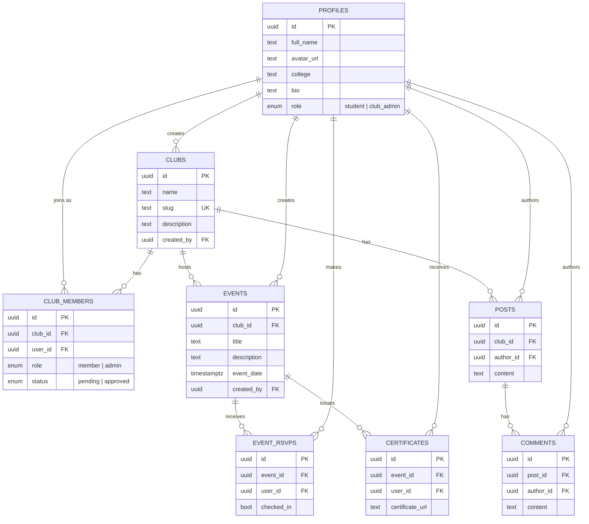

# CampusConnect: Every club. Every event. One brutally simple OS.

**🗣️ Join our Discord Server for all contributors:** [https://discord.gg/BEMjApACe](https://discord.gg/BEMjApACe)


CampusConnect solves the chaos of college clubs juggling WhatsApp groups, spreadsheets, and paper certificates. It provides a single, unified platform for students and organizers to manage events, track memberships, and engage with their campus community seamlessly.

<!-- TODO: Add a demo screenshot or Loom link here -->
<!--  -->

## ✨ Features

- **Event Management:** Create, manage, and promote campus events.
- **RSVP + QR Check-in:** Seamless registration and fast, verifiable QR code check-ins.
- **Club Directory:** Discover and join various campus clubs in one centralized place.
- **Discussion Feed:** Engage with the community through club-specific discussion boards.
- **Certificate Generation:** Automatically generate and distribute event certificates.
- **Realtime Updates:** Instant notifications and live updates powered by Supabase Realtime.

## 🛠️ Tech Stack

| Category            | Technology                                   |
| :------------------ | :------------------------------------------- |
| **Frontend**        | Vite, React, TypeScript, Tailwind CSS        |
| **Backend**         | Supabase (Postgres, Auth, Storage, Realtime) |
| **Package Manager** | Bun                                          |

## 🗄️ Architecture / Database

CampusConnect stores its data in Supabase (Postgres) and uses Supabase Auth plus Row Level Security to protect access. The schema is defined in [supabase/schema.sql](./supabase/schema.sql) and centers on clubs, the members and events they run, and the posts their members write.

### Entity-relationship diagram



### Core tables

| Table | Key columns | Purpose |
| :---- | :---------- | :------ |
| `profiles` | `id` (PK, = `auth.users.id`), `full_name`, `avatar_url`, `college`, `bio`, `role` | One row per authenticated user; auto-created by the `on_auth_user_created` trigger on signup. |
| `clubs` | `id` (PK), `name`, `slug` (unique), `description`, `banner_url`, `logo_url`, `created_by` → `profiles.id` | A campus club or society. `slug` is used for the public `/clubs/:slug` route. |
| `club_members` | `id` (PK), `club_id` → `clubs.id`, `user_id` → `profiles.id`, `role`, `status` | Join table linking users to clubs, with a `member`/`admin` role and a `pending`/`approved` status. |
| `events` | `id` (PK), `club_id` → `clubs.id`, `title`, `description`, `event_date`, `location`, `created_by` → `profiles.id` | An event hosted by a club. |
| `event_rsvps` | `id` (PK), `event_id` → `events.id`, `user_id` → `profiles.id`, `checked_in` | A user's RSVP to an event, plus a `checked_in` flag set on QR check-in. |
| `posts` | `id` (PK), `club_id` → `clubs.id`, `author_id` → `profiles.id`, `content` | A discussion post on a club's feed. |
| `comments` | `id` (PK), `post_id` → `posts.id`, `author_id` → `profiles.id`, `content` | A reply to a post. |
| `certificates` | `id` (PK), `event_id` → `events.id`, `user_id` → `profiles.id`, `certificate_url` | A generated certificate issued to a user for attending an event. |

### Notes

- All tables have Row Level Security enabled; the policies in [supabase/schema.sql](./supabase/schema.sql) define exactly who can read and write data.
- `posts`, `comments`, and `event_rsvps` are included in the `supabase_realtime` publication to power live-updating feed and RSVP behavior.
- Storage buckets such as `avatars`, `club-banners`, `event-banners`, and `certificates` are public-read, with writes restricted to the authenticated user's own folder.

## 🚀 Getting Started

1. **Clone the repository:**
   ```bash
   git clone https://github.com/krushit1307/CampusConnect.git
   cd CampusConnect
   ```
2. **Install dependencies:**
   ```bash
   bun install
   ```
3. **Set up environment variables:**
   ```bash
   cp .env.example .env.local
   ```
   Fill in your Supabase URL and Anon Key in `.env.local`.
4. **Run database migrations (if applicable):**
   ```bash
   supabase db push
   ```
5. **Start the development server:**
   ```bash
   bun run dev
   ```

### 🐳 Running with Docker

Alternatively, you can run the project containerized using Docker. This allows you to build and run the application without needing Bun or Node installed locally on your host machine.

#### Local Development (with Hot-Reloading / HMR)

1. **Set up environment variables:**
   ```bash
   cp .env.example .env.local
   ```
   Fill in your Supabase URL and Anon Key in `.env.local`.

2. **Run database migrations (if applicable):**
   ```bash
   supabase db push
   ```

3. **Start the development container:**
   ```bash
   docker compose up --build
   ```
   This will build the dev image and launch the Vite dev server inside the container. The application will be accessible at `http://localhost:8080` with volume-mounted hot-reloading (HMR) fully functional.

#### Production Build & Run

1. **Build the production Docker image:**
   ```bash
   docker build --target runner -t campusconnect:latest .
   ```

2. **Run the production container:**
   ```bash
   docker run -d -p 3000:3000 --env-file .env.local --name campusconnect campusconnect:latest
   ```
   The production-built Vinxi SSR server will run and serve client traffic on `http://localhost:3000`.

## 📁 Project Structure

- `src/` — Contains all frontend React components, pages, hooks, and utilities.
- `supabase/` — Database migrations, seed data, and Edge Functions.
- `public/` — Static assets like images and fonts.

## 🤝 Contributing

We welcome contributions! Please see our [CONTRIBUTING.md](./CONTRIBUTING.md) for details on how to get started. This is an **ECSoC 2026** project, so we are actively looking for contributors. Check out issues labeled `good-first-issue` to begin!

## 🗺️ Roadmap

- **Phase 1:** Core web platform ✅
- **Phase 2:** Contributor feature build (In Progress)
- **Phase 3:** AI layer (Q4 2026) — AI event recommender, AI post summarizer, RAG chatbot via pgvector

## 📄 License

This project is licensed under the MIT License - see the [LICENSE](./LICENSE) file for details.

## 👤 Maintainer

**Krushit Prajapati** - [GitHub Profile](https://github.com/krushit1307)
